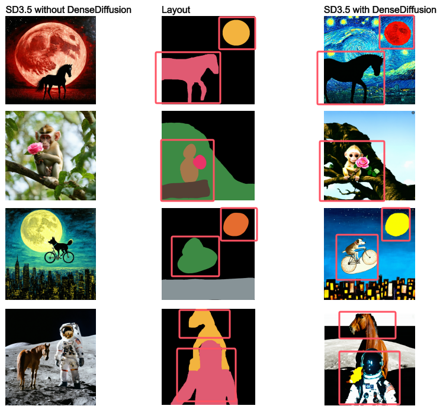

# SD3.5withDense
This repository implements **DenseDiffusion** on top of **Stable Diffusion 3.5**, enabling fine-grained, layout-guided text-to-image generation.

## Overview

**DenseDiffusion** enhances standard diffusion-based generation by introducing **attention modulation** mechanisms. It aligns each sub-prompt with a spatial **layout mask**, ensuring that textual descriptions correspond to specific image regions. This project adapts the original DenseDiffusion implementation (designed for SD1.5) to the newer **Stable Diffusion 3.5 (SD3.5)** architecture.

The following figure illustrates the effectiveness of DenseDiffusion on Stable Diffusion 3.5:

<p align="center">  </p>
Comparison between SD3.5 w/o and w/ DenseDiffusion:

Left column: Images generated by vanilla SD3.5 without layout-guided attention.

Middle column: Semantic layout masks used to control spatial placement.

Right column: Images generated by SD3.5 + DenseDiffusion, showing significantly improved alignment between objects and their intended positions.

As shown, integrating DenseDiffusion leads to better spatial control and semantic consistency, making the generated content more faithful to both what and where described in the prompt.

## 🚀 Usage

1. **Install dependencies:**

   ```bash
   pip install torch torchvision diffusers accelerate transformers

2. **Prepare dataset:**
    1. Put layout images in ./dataset/valset_layout/
    2. Load sub-prompt dataset (e.g., valset.pkl) into ./dataset/
3. **Run inference:**
   ```bash
   python dencemodel.py

4. **Output:**

Images will be saved as image1.png, image2.png, etc., reflecting attention-aware generation results.